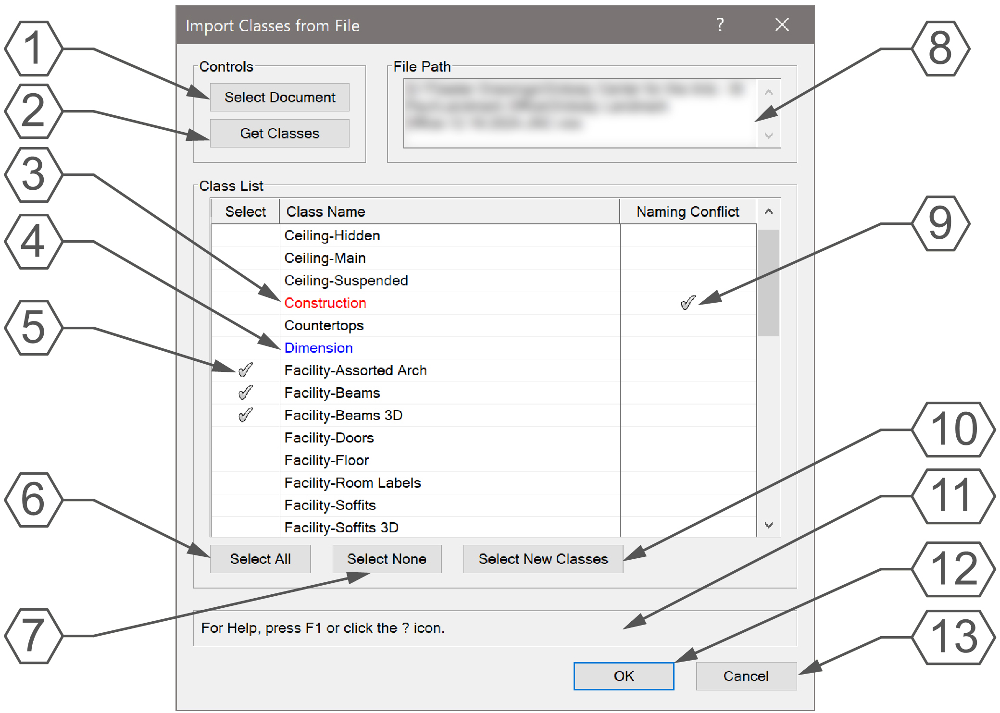

# Import Classes from File

Menu Command

## Version

1.1.0 - 12/25/2024

This plug-in is written in Vectorscript (Pascal) and can be used in any version of [Vectorworks](https://www.vectorworks.net) 2019 or newer.

## Description

Opens a file dialog allowing user to select a Vectorwork document. Once selected, user may select Classes to import into the active document from the selected document.

## Instructions

1. Run menu command
2. Select a Vectorworks document or press **Cancel** to open a blank dialog box
3. If a document has not been selected or if a different document is desired, press **Select Document** to choose a new document
4. If a file path is manually entered in the **File Path** text box, press **Get Classes** to populate the **Class List** browser
5. Select Classes to import by clicking in the **Select** column or through using the **Select All** or **Select New Classes** buttons
6. Press **OK** to import selected Classes into the active document

## Dialog Box Explanation

1. Press the **Select Document** button to open a file dialog to choose a Vectorworks file. If the chosen document is the same VW version as the active document, the **Class List** browser will be populated with classes from the chosen document.
2. Press the **Get Classes** button to populate the **Class List** browser with Classes from the file appearing in the **File Path** text box.  If the selected document's VW version does not match the active document, the **Class List** browser will be empty.
3. Classes with naming conflicts with resources other than Classes will be displayed in Red. These Classes cannot be imported and will be skipped if selected.
4. Classes with naming conflicts with Classes from the active document will be displayed in Blue. If marked for import, the Class settings of the active document will be overwritten with the settings from the imported Class.
5. Click on the **Select** column to mark a Class for import.
6. Press the **Select All** button to mark all Classes for import.
7. Press the **Select None** button to deselect all Classes.
8. The currently chosen file path will appear in the **File Path** text box.
9. Classes with a naming conflict with resources other than Classes will have a check in the **Naming Conflict** column. These Classes cannot be imported.
10. Press the **Select New Classes** button to select all Classes not currently in the active document.
11. **Help Box**, mousing over any dialog box element will display an explanation of the element here.
12. Press the **OK** button to close the dialog box and import all selected Classes into the active drawing.
13. Press the **Cancel** button to close the dialog box without importing any Classes.

## Installation Instructions

There are two methods of installation, direct download of the plug-in or through the **JNC Tools Free Manager** plug-in.

### Direct Download:

1. Download [source plug-in file](Import%20Classes%20from%20File%20.vsm)
2. Place downloaded file inside the **Vectorworks User Folder** within the **Plug-ins** directory
3. Restart Vectorworks

### JNC Tools Free Manager

1. Run the [**JNC Tools Free Manager**](https://jncogs.github.io/JNC-Tools-Manager-Free/) menu command
2. Select the **Import Classes from File** command
3. Press the **Install / Update** button
4. Press **Close** to close the dialog box
5. Restart Vectorworks

## Adding the Plug-in to your Workspace

1. Open the **Workspace Editor** by going to **Tools - Workspaces - Edit Current Workspace**
2. Select the **Menus** tab
3. In the box on the left, find and expand the **JNC** category
4. In the box on the right, find a suitable menu to place the command in, such as **File - Import** or **Tools**
5. Click and drag the **Import Classes from File** command from the box on the left to the desired menu location in the box on the right
6. Click **OK** to close the editor

## Localization Instructions

The plug-in can be localized to your native language without having access to the source code.  This can be achieved by following the instructions below:

1. Open the **Plug-in Manager** by going to **Tools - Plug-ins - Plug-in Manager**
2. Select the **Third-party Plug-ins** tab
3. Select the **Import Classes from File** command
4. Click the **Customize** button
5. Select the **Strings** tab
6. Double-click a category, such as **Dialog Strings**
7. Select a string to edit and press the **Edit** button
8. Write a new string and press the **OK** button until you are back to the **Plug-in Manager**

The categories for this plug-in are as follows:

- **3000** - *Dialog Strings*: These strings are used in the dialog box and can all freely be changed
- **4000** - *Dialog Help Strings*: These strings are used in the **Help Box** ad the bottom of the dialog box and can all be freely changed
- **5000** - *Misc Strings*: These strings serve multiple purpose in the code, only string **5000** can be changed

## Release Notes

| Date | Version | Note |
| :---: | :---: | :--- |
| 06/04/2022 | 1.0.0 | Initial release |
| 05/09/2023 | 1.0.0 | Added Version Control (no other changes) |
| 12/25/2024 | 1.1.0 | Overhauled GUI and made resizable |
| - | - | Updated Select Document for direct VWX document selection |
| - | - | Automatically retrieve classes when document selected |
| - | - | Automatically open file dialog on running command |

## Known Bugs

No Known Bugs

## Feature Requests

No current Feature Requests

## License

Copyright (c) Jesse Cogswell (JNC Tools)

Permission is hereby granted, free of charge, to any person or organization
obtaining a copy of this software (the "User") and associated documentation files (the "Software"),
to use, reproduce, distribute, execute, and transmit the Software.

The User is not permitted to modify or attempt to reverse engineer the source code.  The User may
localize the Software using approved methods from within the Vectorworks software.

THE SOFTWARE IS PROVIDED "AS IS", WITHOUT WARRANTY OF ANY KIND, EXPRESS OR
IMPLIED, INCLUDING BUT NOT LIMITED TO THE WARRANTIES OF MERCHANTABILITY,
FITNESS FOR A PARTICULAR PURPOSE, TITLE AND NON-INFRINGEMENT. IN NO EVENT
SHALL THE COPYRIGHT HOLDERS OR ANYONE DISTRIBUTING THE SOFTWARE BE LIABLE
FOR ANY DAMAGES OR OTHER LIABILITY, WHETHER IN CONTRACT, TORT OR OTHERWISE,
ARISING FROM, OUT OF OR IN CONNECTION WITH THE SOFTWARE OR THE USE OR OTHER
DEALINGS IN THE SOFTWARE.